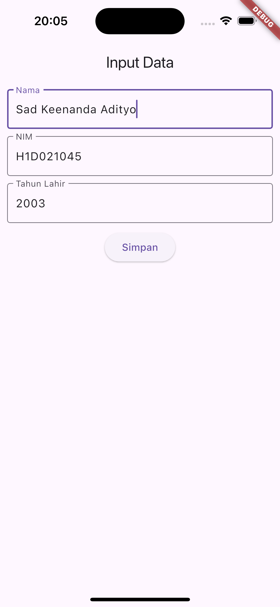

# Tugas Pertemuan 2

Fork dan clone repository ini, lalu jalankan perintah 
```
flutter pub get
```
Buatlah tampilan form yang berisi nama, nim, dan tahun lahir pada file `ui/form_data.dart`, lalu buatlah tampilan hasil dari input data tersebut pada file `ui/tampil_data.dart`

JELASKAN PROSES PASSING DATA DARI FORM MENUJU TAMPILAN DENGAN FILE `README.md`

Buat tampilan semenarik mungkin untuk dilihat.


Nama : Sad Keenanda Adityo

NIM : H1D021045

Shift Baru: F

## Screenshot
Contoh :


